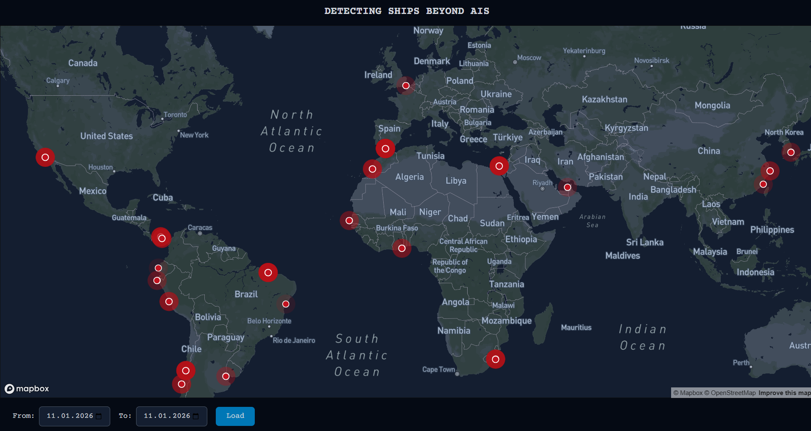
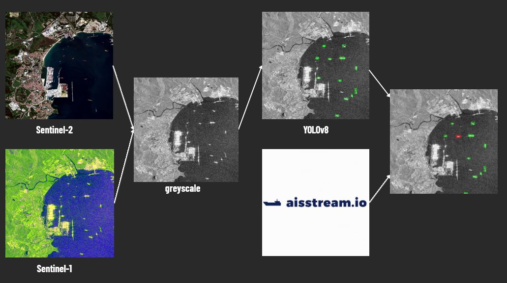
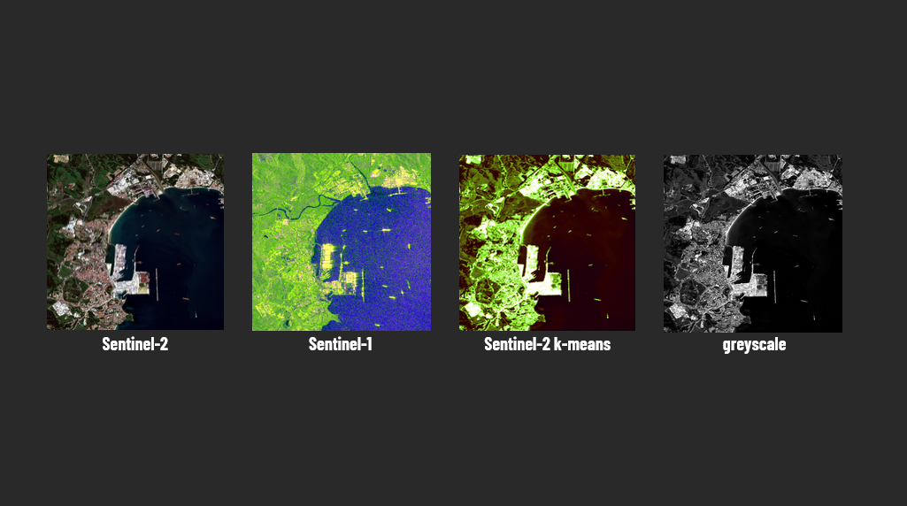
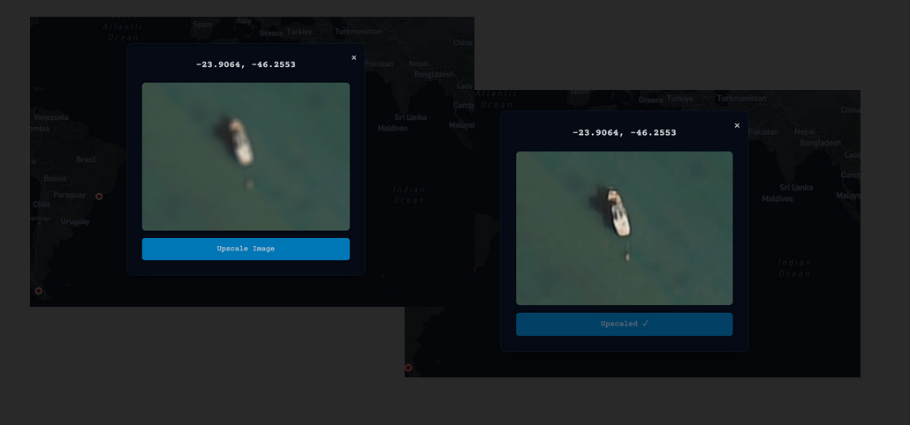

# Detecting Ships Beyond AIS

Satellite-based ship detection using SAR imagery and deep learning to identify vessels operating without AIS transmitters.

## Overview

AIS transmitters can be easily disabled, making ships invisible to conventional tracking. This system uses Sentinel-1 SAR radar and machine learning to detect vessels regardless of AIS status.


*Ships operating without AIS enable illegal fishing, smuggling, and increase collision risk*

## Architecture



The system processes satellite imagery through three stages:

1. **Preprocessing**: k-means clustering and grayscale conversion on Sentinel-1/2 data
2. **Detection**: Fine-tuned YOLOv8 model identifies vessels in SAR imagery
3. **Enhancement**: NAFNET super-resolution improves detection quality

### Data Processing


*Multi-source preprocessing: Sentinel-2 → k-means → grayscale conversion for optimal model input*

### Image Enhancement


*NAFNET enhancement results: blurry input → prediction → original comparison*

The NAFNET model was fine-tuned on maritime vessel imagery to handle:
- Low-resolution SAR detections
- Varying ship sizes and orientations
- Noise reduction in radar imagery

## Technical Stack

- **Detection**: YOLOv8 (fine-tuned on SAR vessel dataset)
- **Enhancement**: NAFNET (custom-trained for ship imagery)
- **Data**: Sentinel-1 SAR, Sentinel-2 optical
- **Backend**: Python, PyTorch
- **Frontend**: JavaScript

## Installation

```bash
git clone https://github.com/szTworek/BITEhack-hackathon.git
cd BITEhack-hackathon

# Backend
cd backend
pip install -r requirements.txt

# Frontend
cd frontend
npm install
```

Configure Sentinel Hub API credentials:
```bash
cp .env.example .env
# Add credentials to .env
```

## Usage

```bash
# Start backend
cd backend
python main.py

# Start frontend
cd frontend
npm start
```

## Future Work

- Real-time processing with live satellite feeds
- Bayesian trajectory prediction
- Vessel type classification (cargo, fishing, tanker)
- Expanded training dataset for improved accuracy

## References

- [Sentinel-1 Technical Guide](https://sentinel.esa.int/web/sentinel/user-guides/sentinel-1-sar)
- [YOLOv8 Documentation](https://docs.ultralytics.com/)
- [NAFNET Paper](https://arxiv.org/abs/2204.04676)

---

Built at BITEhack Hackathon by [Szymon Tworek](https://github.com/szTworek), [Robert Raniszewski](https://github.com/raniszewski-robert), [Albert Arnautov](https://github.com/alargh) and [Iwo Zowada](https://github.com/Iwo-Z)